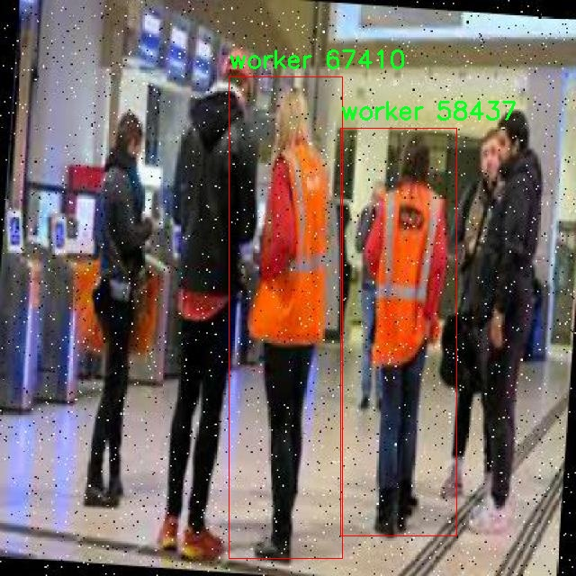

# 铁路工人检测检测系统源码分享
 # [一条龙教学YOLOV8标注好的数据集一键训练_70+全套改进创新点发刊_Web前端展示]

### 1.研究背景与意义

项目参考[AAAI Association for the Advancement of Artificial Intelligence](https://gitee.com/qunmasj/projects)

项目来源[AACV Association for the Advancement of Computer Vision](https://kdocs.cn/l/cszuIiCKVNis)

研究背景与意义

随着全球铁路运输的快速发展，铁路安全问题日益受到重视。铁路工人作为保障铁路安全和顺畅运行的重要一环，其工作环境和作业行为的监测显得尤为重要。传统的人工监测方式不仅效率低下，而且容易受到人为因素的影响，难以实现对铁路工人实时、全面的监控。因此，基于计算机视觉的自动检测系统逐渐成为研究的热点。YOLO（You Only Look Once）系列模型因其高效的实时目标检测能力而被广泛应用于各类场景中，尤其是在复杂环境下的目标识别任务中展现出优越的性能。

本研究旨在基于改进的YOLOv8模型，构建一个高效的铁路工人检测系统。通过对现有YOLOv8模型的优化，提升其在铁路工人检测中的准确性和实时性，能够有效地减少因人为疏忽导致的安全隐患。该系统的核心在于对铁路工人进行精准识别与定位，确保在铁路作业过程中能够及时发现潜在的安全风险，并采取相应的防范措施。

在数据集方面，本研究使用的“railroad”模块包含3600张图像，涵盖了三类目标。这些数据不仅为模型的训练提供了丰富的样本，也为模型的评估和验证奠定了基础。通过对不同类别的铁路工人进行标注与分类，研究将能够深入分析不同工种在作业过程中的行为特征，从而为后续的安全管理和培训提供数据支持。

改进YOLOv8模型的意义在于，首先，它能够提升检测精度，尤其是在复杂背景和多变光照条件下，确保铁路工人能够被准确识别。其次，改进后的模型将具备更快的处理速度，能够实现实时监控，为铁路安全管理提供及时的预警。此外，基于深度学习的检测系统具有良好的扩展性，未来可以根据实际需求，进一步扩展到其他铁路相关的安全监测任务中。

通过本研究的实施，期望能够为铁路工人的安全管理提供一种新型的技术手段，降低事故发生率，提高铁路运输的安全性。同时，研究成果也将为其他领域的目标检测应用提供借鉴，推动计算机视觉技术在实际应用中的发展。总之，基于改进YOLOv8的铁路工人检测系统不仅具有重要的学术价值，也具有广泛的社会意义，为构建安全、高效的铁路运输体系贡献力量。

### 2.图片演示


##### 注意：由于此博客编辑较早，上面“2.图片演示”和“3.视频演示”展示的系统图片或者视频可能为老版本，新版本在老版本的基础上升级如下：（实际效果以升级的新版本为准）

  （1）适配了YOLOV8的“目标检测”模型和“实例分割”模型，通过加载相应的权重（.pt）文件即可自适应加载模型。

  （2）支持“图片识别”、“视频识别”、“摄像头实时识别”三种识别模式。

  （3）支持“图片识别”、“视频识别”、“摄像头实时识别”三种识别结果保存导出，解决手动导出（容易卡顿出现爆内存）存在的问题，识别完自动保存结果并导出到tempDir中。

  （4）支持Web前端系统中的标题、背景图等自定义修改，后面提供修改教程。

  另外本项目提供训练的数据集和训练教程,暂不提供权重文件（best.pt）,需要您按照教程进行训练后实现图片演示和Web前端界面演示的效果。

### 3.视频演示

[3.1 视频演示](https://www.bilibili.com/video/BV11ssbe1EzP/)

### 4.数据集信息展示

##### 4.1 本项目数据集详细数据（类别数＆类别名）

nc: 1
names: ['worker']


##### 4.2 本项目数据集信息介绍

数据集信息展示

在本研究中，我们采用了名为“railroad”的数据集，以训练和改进YOLOv8模型，旨在实现高效的铁路工人检测系统。该数据集专注于单一类别的对象识别，具体类别为“worker”，即铁路工人。通过精心收集和标注的图像数据，“railroad”数据集为我们提供了一个丰富的训练基础，使得模型能够在复杂的铁路环境中准确识别和定位工人。

“railroad”数据集的构建过程考虑到了铁路工人工作环境的多样性和复杂性。数据集中包含了在不同时间、不同天气条件和不同作业场景下拍摄的铁路工人图像。这种多样性不仅增强了模型的泛化能力，还提高了其在实际应用中的鲁棒性。通过使用各种角度和距离拍摄的图像，数据集确保了模型能够学习到铁路工人在各种情况下的外观特征，包括穿着的工作服、使用的工具以及与周围环境的互动。

为了保证数据集的质量和有效性，所有图像均经过严格的标注过程。标注团队由经验丰富的专业人员组成，他们对铁路工人的工作特点有深入的理解，能够准确地识别出图像中的工人，并为其提供精确的边界框。这种高质量的标注为YOLOv8模型的训练提供了坚实的基础，使得模型能够在学习过程中获得准确的反馈，从而提高检测精度。

在数据集的使用过程中，我们还进行了数据增强，以进一步提升模型的性能。通过旋转、缩放、裁剪和颜色变换等技术，我们生成了多样化的训练样本，增加了模型在面对不同视觉条件时的适应能力。这种增强策略不仅丰富了训练数据的多样性，还有效防止了模型的过拟合现象，确保其在实际应用中的可靠性。

此外，为了评估模型的性能，我们将“railroad”数据集划分为训练集和验证集。训练集用于模型的学习和参数调整，而验证集则用于定期评估模型的检测能力。这种划分方式使得我们能够在训练过程中实时监控模型的表现，并根据验证结果进行相应的调整和优化。

总之，“railroad”数据集为改进YOLOv8的铁路工人检测系统提供了丰富的训练资源和高质量的标注数据。通过多样化的图像样本和严格的标注流程，我们期望该数据集能够显著提升模型在铁路工人检测任务中的准确性和效率。随着铁路安全管理的日益重要，准确检测和识别铁路工人将为提高工作场所的安全性和保障铁路运输的顺畅运行提供重要支持。我们相信，通过对“railroad”数据集的深入研究和应用，能够为铁路行业的智能化发展贡献一份力量。





### 5.全套项目环境部署视频教程（零基础手把手教学）

[5.1 环境部署教程链接（零基础手把手教学）](https://www.ixigua.com/7404473917358506534?logTag=c807d0cbc21c0ef59de5)


[5.2 安装Python虚拟环境创建和依赖库安装视频教程链接（零基础手把手教学）](https://www.ixigua.com/7404474678003106304?logTag=1f1041108cd1f708b01a)

### 6.手把手YOLOV8训练视频教程（零基础小白有手就能学会）

[6.1 手把手YOLOV8训练视频教程（零基础小白有手就能学会）](https://www.ixigua.com/7404477157818401292?logTag=d31a2dfd1983c9668658)

### 7.70+种全套YOLOV8创新点代码加载调参视频教程（一键加载写好的改进模型的配置文件）

[7.1 70+种全套YOLOV8创新点代码加载调参视频教程（一键加载写好的改进模型的配置文件）](https://www.ixigua.com/7404478314661806627?logTag=29066f8288e3f4eea3a4)

### 8.70+种全套YOLOV8创新点原理讲解（非科班也可以轻松写刊发刊，V10版本正在科研待更新）

由于篇幅限制，每个创新点的具体原理讲解就不一一展开，具体见下列网址中的创新点对应子项目的技术原理博客网址【Blog】：


[8.1 70+种全套YOLOV8创新点原理讲解链接](https://gitee.com/qunmasj/good)

### 9.系统功能展示（检测对象为举例，实际内容以本项目数据集为准）

图9.1.系统支持检测结果表格显示

  图9.2.系统支持置信度和IOU阈值手动调节

  图9.3.系统支持自定义加载权重文件best.pt(需要你通过步骤5中训练获得)

  图9.4.系统支持摄像头实时识别

  图9.5.系统支持图片识别

  图9.6.系统支持视频识别

  图9.7.系统支持识别结果文件自动保存

  图9.8.系统支持Excel导出检测结果数据


### 10.原始YOLOV8算法原理

原始YOLOv8算法原理

YOLO（You Only Look Once）系列算法自其首次提出以来，便以其高效的目标检测能力而广受关注。YOLOv8作为该系列的最新版本，承载了前几代算法的优点，并在此基础上进行了诸多创新与改进，使其在训练时间和检测精度上均得到了显著提升。其设计理念依然是将目标检测任务转化为一个回归问题，通过一个单一的神经网络模型同时预测目标的位置和类别，极大地简化了传统目标检测方法中复杂的多阶段处理流程。

YOLOv8的网络结构由三个主要部分组成：主干网络（Backbone）、特征增强网络（Neck）和检测头（Head）。主干网络采用了CSP（Cross Stage Partial）思想，旨在通过分离和重组特征通道来提高特征提取的效率和效果。具体而言，YOLOv8在主干网络中引入了C2f模块，这一模块结合了YOLOv7中的ELAN（Efficient Layer Aggregation Network）思想，增加了更多的残差连接，使得模型在保持轻量化的同时，能够获得更丰富的梯度信息。这种设计使得网络在训练过程中能够更好地传递信息，进而提高了模型的收敛速度和检测精度。

在特征增强网络方面，YOLOv8继续采用PAN-FPN（Path Aggregation Network - Feature Pyramid Network）的结构，这一结构通过多尺度特征融合，增强了模型对不同尺度目标的检测能力。PAN-FPN的设计使得网络能够在不同层次上提取特征，并通过上采样和下采样的方式有效地整合这些特征，从而提升了目标检测的准确性和鲁棒性。值得注意的是，YOLOv8在这一部分的设计上进行了简化，删除了上采样部分的卷积结构，以减少计算量并提高处理速度。

检测头部分是YOLOv8的一大创新点。与以往的耦合头不同，YOLOv8采用了解耦合头结构，将分类和回归任务分为两个独立的分支。这一设计使得模型能够更专注于各自的任务，减少了在复杂场景下可能出现的定位不准和分类错误的问题。通过这种解耦合的方式，YOLOv8在分类和定位任务的收敛速度和精度上均得到了显著提升。此外，YOLOv8还引入了Anchor-free目标检测方法，摒弃了传统方法中对锚点框的依赖，直接预测目标的位置和大小。这一方法不仅简化了模型的设计，还提高了模型对不同尺度和形状目标的适应能力，使得网络能够更快地聚焦于目标位置的邻近点，从而使预测框更接近于实际边界框区域。

在训练过程中，YOLOv8针对数据增强策略进行了优化，特别是在训练的最后10个epoch中停止使用Mosaic数据增强。这一调整是基于对数据真实分布的考虑，旨在避免模型学习到不良信息，从而提高模型的泛化能力。此外，YOLOv8还采用了动态任务对齐学习（Task Alignment Learning）策略，通过引入分类分数和IOU的高次幂乘积作为衡量任务对齐程度的指标，进一步提升了模型在分类和定位任务上的表现。

在损失函数的设计上，YOLOv8使用了BCELoss作为分类损失，DFLLoss和CIoULoss作为回归损失。这种多损失函数的设计使得模型在训练过程中能够更好地平衡分类和定位任务的权重，从而提高整体的检测性能。

综上所述，YOLOv8在保持YOLO系列一贯高效特性的基础上，通过一系列创新的设计和优化，进一步提升了目标检测的精度和速度。其轻量化的模型结构使得YOLOv8能够在各种嵌入式设备上进行实时检测，满足了现代应用对目标检测技术的高要求。随着YOLOv8的推出，目标检测领域的研究和应用将迎来新的机遇与挑战，尤其是在需要快速响应和高准确率的场景中，YOLOv8无疑将成为一个重要的工具。


### 11.项目核心源码讲解（再也不用担心看不懂代码逻辑）

#### 11.1 ui.py

以下是经过精简和注释的核心代码：

```python
import sys
import subprocess

def run_script(script_path):
    """
    使用当前 Python 环境运行指定的脚本。

    Args:
        script_path (str): 要运行的脚本路径
    """
    # 获取当前 Python 解释器的路径
    python_path = sys.executable

    # 构建运行命令，使用 streamlit 运行指定的脚本
    command = f'"{python_path}" -m streamlit run "{script_path}"'

    # 执行命令，并捕获结果
    result = subprocess.run(command, shell=True)
    
    # 检查命令执行是否成功
    if result.returncode != 0:
        print("脚本运行出错。")

# 程序入口
if __name__ == "__main__":
    # 指定要运行的脚本路径
    script_path = "web.py"  # 假设脚本在当前目录下

    # 调用函数运行脚本
    run_script(script_path)
```

### 代码注释说明：
1. **导入模块**：
   - `sys`：用于获取当前 Python 解释器的路径。
   - `subprocess`：用于执行外部命令。

2. **`run_script` 函数**：
   - 该函数接受一个参数 `script_path`，表示要运行的 Python 脚本的路径。
   - 使用 `sys.executable` 获取当前 Python 解释器的路径。
   - 构建命令字符串，使用 `streamlit` 模块运行指定的脚本。
   - 使用 `subprocess.run` 执行命令，并通过 `shell=True` 允许在 shell 中执行。
   - 检查命令的返回码，如果不为 0，表示执行出错，打印错误信息。

3. **程序入口**：
   - 使用 `if __name__ == "__main__":` 确保只有在直接运行该脚本时才会执行以下代码。
   - 指定要运行的脚本路径（这里假设脚本在当前目录下）。
   - 调用 `run_script` 函数执行指定的脚本。

这个文件是一个 Python 脚本，主要用于运行一个名为 `web.py` 的脚本。首先，文件导入了几个必要的模块，包括 `sys`、`os` 和 `subprocess`，这些模块提供了与系统交互的功能。`sys` 模块用于访问与 Python 解释器相关的变量和函数，`os` 模块用于与操作系统进行交互，而 `subprocess` 模块则用于执行外部命令。

接下来，定义了一个名为 `run_script` 的函数，该函数接受一个参数 `script_path`，表示要运行的脚本的路径。在函数内部，首先获取当前 Python 解释器的路径，这通过 `sys.executable` 实现。然后，构建一个命令字符串，该命令使用当前的 Python 解释器来运行 `streamlit` 模块，并指定要运行的脚本路径。`streamlit` 是一个用于构建数据应用的框架。

随后，使用 `subprocess.run` 方法执行构建好的命令。该方法的 `shell=True` 参数允许在 shell 中执行命令。执行后，检查命令的返回码，如果返回码不为 0，表示脚本运行过程中出现了错误，程序会打印出“脚本运行出错”的提示信息。

在文件的最后部分，使用 `if __name__ == "__main__":` 语句来确保当脚本作为主程序运行时才会执行后续代码。这里指定了要运行的脚本路径为 `web.py`，并调用 `run_script` 函数来执行这个脚本。

总的来说，这个文件的主要功能是为 `web.py` 脚本提供一个运行环境，利用当前的 Python 解释器和 `streamlit` 模块来启动一个数据应用。

#### 11.2 70+种YOLOv8算法改进源码大全和调试加载训练教程（非必要）\ultralytics\models\yolo\detect\train.py

以下是经过简化和注释的核心代码部分：

```python
# 导入必要的库
from copy import copy
import numpy as np
from ultralytics.data import build_dataloader, build_yolo_dataset
from ultralytics.engine.trainer import BaseTrainer
from ultralytics.models import yolo
from ultralytics.nn.tasks import DetectionModel
from ultralytics.utils import LOGGER, RANK
from ultralytics.utils.torch_utils import de_parallel, torch_distributed_zero_first

class DetectionTrainer(BaseTrainer):
    """
    DetectionTrainer类，继承自BaseTrainer，用于基于检测模型的训练。
    """

    def build_dataset(self, img_path, mode='train', batch=None):
        """
        构建YOLO数据集。

        参数:
            img_path (str): 包含图像的文件夹路径。
            mode (str): 模式，'train'或'val'，用户可以为每种模式自定义不同的数据增强。
            batch (int, optional): 批次大小，仅用于'rect'模式。默认为None。
        """
        # 获取模型的最大步幅，确保步幅至少为32
        gs = max(int(de_parallel(self.model).stride.max() if self.model else 0), 32)
        # 构建YOLO数据集
        return build_yolo_dataset(self.args, img_path, batch, self.data, mode=mode, rect=mode == 'val', stride=gs)

    def get_dataloader(self, dataset_path, batch_size=16, rank=0, mode='train'):
        """构造并返回数据加载器。"""
        assert mode in ['train', 'val']  # 确保模式有效
        with torch_distributed_zero_first(rank):  # 在分布式训练中，仅初始化一次数据集
            dataset = self.build_dataset(dataset_path, mode, batch_size)
        shuffle = mode == 'train'  # 训练模式下打乱数据
        # 如果使用'rect'模式，且需要打乱，则警告并关闭打乱
        if getattr(dataset, 'rect', False) and shuffle:
            LOGGER.warning("WARNING ⚠️ 'rect=True'与DataLoader的shuffle不兼容，设置shuffle=False")
            shuffle = False
        workers = self.args.workers if mode == 'train' else self.args.workers * 2  # 根据模式设置工作线程数
        return build_dataloader(dataset, batch_size, workers, shuffle, rank)  # 返回数据加载器

    def preprocess_batch(self, batch):
        """对图像批次进行预处理，缩放并转换为浮点数。"""
        batch['img'] = batch['img'].to(self.device, non_blocking=True).float() / 255  # 归一化图像
        return batch

    def set_model_attributes(self):
        """设置模型的属性，包括类别数量和名称。"""
        self.model.nc = self.data['nc']  # 将类别数量附加到模型
        self.model.names = self.data['names']  # 将类别名称附加到模型
        self.model.args = self.args  # 将超参数附加到模型

    def get_model(self, cfg=None, weights=None, verbose=True):
        """返回YOLO检测模型。"""
        model = DetectionModel(cfg, nc=self.data['nc'], verbose=verbose and RANK == -1)  # 创建检测模型
        if weights:
            model.load(weights)  # 加载权重
        return model

    def get_validator(self):
        """返回用于YOLO模型验证的DetectionValidator。"""
        self.loss_names = 'box_loss', 'cls_loss', 'dfl_loss'  # 定义损失名称
        return yolo.detect.DetectionValidator(self.test_loader, save_dir=self.save_dir, args=copy(self.args))

    def plot_training_samples(self, batch, ni):
        """绘制训练样本及其注释。"""
        plot_images(images=batch['img'],
                    batch_idx=batch['batch_idx'],
                    cls=batch['cls'].squeeze(-1),
                    bboxes=batch['bboxes'],
                    paths=batch['im_file'],
                    fname=self.save_dir / f'train_batch{ni}.jpg',
                    on_plot=self.on_plot)

    def plot_metrics(self):
        """从CSV文件绘制指标。"""
        plot_results(file=self.csv, on_plot=self.on_plot)  # 保存结果图
```

### 代码说明：
1. **类定义**：`DetectionTrainer`类用于训练YOLO检测模型，继承自`BaseTrainer`。
2. **数据集构建**：`build_dataset`方法根据给定的图像路径和模式构建YOLO数据集。
3. **数据加载器**：`get_dataloader`方法创建并返回数据加载器，支持分布式训练。
4. **批处理预处理**：`preprocess_batch`方法对图像批次进行归一化处理。
5. **模型属性设置**：`set_model_attributes`方法将类别数量和名称设置到模型中。
6. **模型获取**：`get_model`方法返回YOLO检测模型，并可选择加载预训练权重。
7. **验证器获取**：`get_validator`方法返回用于模型验证的对象。
8. **绘图功能**：`plot_training_samples`和`plot_metrics`方法用于可视化训练样本和训练指标。

该程序文件是用于训练YOLO（You Only Look Once）目标检测模型的代码，继承自基础训练器类`BaseTrainer`。它包含了多个方法，用于构建数据集、获取数据加载器、预处理图像批次、设置模型属性、获取模型、验证模型、记录损失、显示训练进度、绘制训练样本和绘制训练指标等。

首先，`build_dataset`方法用于构建YOLO数据集，接受图像路径、模式（训练或验证）和批次大小作为参数。它会根据模型的步幅计算出合适的步幅值，并调用`build_yolo_dataset`函数来创建数据集。

接着，`get_dataloader`方法构建并返回数据加载器。它会根据模式（训练或验证）来决定是否打乱数据，并根据需要调整工作线程的数量。这里还包含了一个重要的分布式训练的初始化步骤，确保数据集只初始化一次。

`preprocess_batch`方法用于对图像批次进行预处理，将图像数据转换为浮点数并缩放到0到1之间。

`set_model_attributes`方法用于设置模型的属性，包括类别数量和类别名称等，以确保模型与数据集的配置一致。

`get_model`方法返回一个YOLO检测模型，并在提供权重时加载这些权重。

`get_validator`方法返回一个用于验证YOLO模型的验证器，并设置损失名称。

`label_loss_items`方法用于返回带有标签的训练损失项字典，便于监控训练过程中的损失变化。

`progress_string`方法返回一个格式化的字符串，显示训练进度，包括当前的epoch、GPU内存使用情况、损失值、实例数量和图像大小等信息。

`plot_training_samples`方法用于绘制训练样本及其标注，方便可视化训练数据的质量。

最后，`plot_metrics`和`plot_training_labels`方法分别用于绘制训练过程中的指标和标签，帮助用户分析模型的训练效果。

总体而言，该文件为YOLO模型的训练提供了全面的支持，包括数据处理、模型设置、训练监控和结果可视化等功能，是YOLOv8算法改进的重要组成部分。

#### 11.3 code\utils.py

以下是经过简化和注释的核心代码部分：

```python
import os
import cv2
import pandas as pd
import streamlit as st
from PIL import Image
from QtFusion.path import abs_path

def save_uploaded_file(uploaded_file):
    """
    保存上传的文件到服务器上。

    Args:
        uploaded_file (UploadedFile): 通过Streamlit上传的文件。

    Returns:
        str: 保存文件的完整路径，如果没有文件上传则返回 None。
    """
    # 检查是否有文件上传
    if uploaded_file is not None:
        base_path = "tempDir"  # 定义文件保存的基本路径

        # 如果路径不存在，创建这个路径
        if not os.path.exists(base_path):
            os.makedirs(base_path)
        
        # 获取文件的完整路径
        file_path = os.path.join(base_path, uploaded_file.name)

        # 以二进制写模式打开文件并写入内容
        with open(file_path, "wb") as f:
            f.write(uploaded_file.getbuffer())  # 将上传的文件内容写入到指定路径

        return file_path  # 返回文件路径

    return None  # 如果没有文件上传，返回 None


def concat_results(result, location, confidence, time):
    """
    显示检测结果。

    Args:
        result (str): 检测结果。
        location (str): 检测位置。
        confidence (str): 置信度。
        time (str): 检测用时。

    Returns:
        DataFrame: 包含检测结果的 DataFrame。
    """
    # 创建一个包含检测信息的字典
    result_data = {
        "识别结果": [result],
        "位置": [location],
        "置信度": [confidence],
        "用时": [time]
    }

    # 将字典转换为 DataFrame
    results_df = pd.DataFrame(result_data)
    return results_df


def get_camera_names():
    """
    获取可用摄像头名称列表。

    Returns:
        list: 返回包含“未启用摄像头”和可用摄像头索引号的列表。
    """
    camera_names = ["摄像头检测关闭", "0"]  # 初始化摄像头名称列表
    max_test_cameras = 10  # 定义要测试的最大摄像头数量

    # 测试摄像头索引
    for i in range(max_test_cameras):
        cap = cv2.VideoCapture(i, cv2.CAP_DSHOW)  # 尝试打开摄像头
        if cap.isOpened() and str(i) not in camera_names:  # 如果成功打开
            camera_names.append(str(i))  # 添加摄像头索引到列表
            cap.release()  # 释放摄像头资源

    # 如果没有找到可用的摄像头，输出提示信息
    if len(camera_names) == 1:
        st.write("未找到可用的摄像头")
    
    return camera_names  # 返回摄像头名称列表
```

### 代码说明：
1. **save_uploaded_file**: 该函数用于保存用户通过Streamlit上传的文件到服务器的指定目录中。它会检查是否有文件上传，并在必要时创建保存目录。

2. **concat_results**: 该函数用于将检测结果、位置、置信度和用时信息整理成一个Pandas DataFrame，方便后续展示和处理。

3. **get_camera_names**: 该函数用于检测可用的摄像头，并返回一个包含摄像头索引的列表。如果没有找到可用的摄像头，会输出相应的提示信息。

这个程序文件 `utils.py` 包含了一些用于处理文件上传、显示检测结果、加载默认图片以及获取可用摄像头名称的实用函数。以下是对每个函数的详细说明。

首先，`save_uploaded_file` 函数用于保存用户通过 Streamlit 上传的文件。它接收一个参数 `uploaded_file`，这是一个包含上传文件信息的对象。函数首先检查是否有文件被上传，如果有，则定义一个基本路径 `tempDir` 用于存储文件。如果该路径不存在，函数会创建这个目录。接着，函数构建文件的完整路径，并以二进制写入模式打开文件，将上传的内容写入到指定路径中。最后，函数返回保存文件的完整路径，如果没有文件上传，则返回 `None`。

接下来，`concat_results` 函数用于将检测结果以表格的形式展示。它接收四个参数：`result`（检测结果）、`location`（检测位置）、`confidence`（置信度）和 `time`（检测用时）。函数创建一个包含这些信息的字典，并将其转换为 Pandas 的 DataFrame 格式，方便后续的数据处理和展示。

`load_default_image` 函数用于加载一个默认的图片。它调用 `abs_path` 函数获取默认图片的绝对路径，然后使用 PIL 库打开该图片并返回图片对象。这在需要展示默认图像时非常有用。

最后，`get_camera_names` 函数用于获取系统中可用的摄像头名称。它初始化一个包含“摄像头检测关闭”和第一个摄像头索引“0”的列表。然后，函数尝试打开多个摄像头（最多测试 10 个），如果成功打开某个摄像头，则将其索引添加到列表中。函数在结束时检查是否找到可用的摄像头，如果没有找到，则通过 Streamlit 显示一条消息。最终，函数返回可用摄像头的名称列表。

总体来说，这个文件提供了一些基本的工具函数，方便在 Streamlit 应用中处理文件上传、展示结果和管理摄像头。

#### 11.4 70+种YOLOv8算法改进源码大全和调试加载训练教程（非必要）\ultralytics\nn\backbone\CSwomTramsformer.py

以下是提取出的核心代码部分，并附上详细的中文注释：

```python
import torch
import torch.nn as nn
import numpy as np

class Mlp(nn.Module):
    """多层感知机（MLP）模块"""
    def __init__(self, in_features, hidden_features=None, out_features=None, act_layer=nn.GELU, drop=0.):
        super().__init__()
        out_features = out_features or in_features  # 输出特征数默认为输入特征数
        hidden_features = hidden_features or in_features  # 隐藏层特征数默认为输入特征数
        self.fc1 = nn.Linear(in_features, hidden_features)  # 第一层线性变换
        self.act = act_layer()  # 激活函数
        self.fc2 = nn.Linear(hidden_features, out_features)  # 第二层线性变换
        self.drop = nn.Dropout(drop)  # Dropout层

    def forward(self, x):
        """前向传播"""
        x = self.fc1(x)  # 线性变换
        x = self.act(x)  # 激活
        x = self.drop(x)  # Dropout
        x = self.fc2(x)  # 线性变换
        x = self.drop(x)  # Dropout
        return x

class LePEAttention(nn.Module):
    """局部增强位置编码注意力模块"""
    def __init__(self, dim, resolution, idx, split_size=7, num_heads=8, attn_drop=0.):
        super().__init__()
        self.dim = dim  # 输入特征维度
        self.resolution = resolution  # 输入分辨率
        self.split_size = split_size  # 切分窗口大小
        self.num_heads = num_heads  # 注意力头数
        head_dim = dim // num_heads  # 每个头的维度
        self.scale = head_dim ** -0.5  # 缩放因子

        # 根据索引设置窗口的高度和宽度
        if idx == -1:
            self.H_sp, self.W_sp = resolution, resolution
        elif idx == 0:
            self.H_sp, self.W_sp = resolution, split_size
        elif idx == 1:
            self.W_sp, self.H_sp = resolution, split_size
        else:
            raise ValueError("ERROR MODE")

        self.attn_drop = nn.Dropout(attn_drop)  # 注意力Dropout层

    def im2cswin(self, x):
        """将输入图像转换为窗口"""
        B, N, C = x.shape  # B: 批量大小, N: 位置数, C: 特征维度
        H = W = int(np.sqrt(N))  # 计算图像的高度和宽度
        x = x.transpose(-2, -1).contiguous().view(B, C, H, W)  # 变换维度
        x = img2windows(x, self.H_sp, self.W_sp)  # 切分为窗口
        return x

    def forward(self, qkv):
        """前向传播"""
        q, k, v = qkv  # 分别获取查询、键、值
        q = self.im2cswin(q)  # 将查询转换为窗口
        k = self.im2cswin(k)  # 将键转换为窗口
        # 计算注意力
        attn = (q @ k.transpose(-2, -1)) * self.scale  # 计算注意力分数
        attn = nn.functional.softmax(attn, dim=-1)  # 归一化
        attn = self.attn_drop(attn)  # 应用Dropout
        x = attn @ v  # 加权求和
        return x

class CSWinBlock(nn.Module):
    """CSWin Transformer块"""
    def __init__(self, dim, reso, num_heads, mlp_ratio=4.):
        super().__init__()
        self.dim = dim  # 输入特征维度
        self.num_heads = num_heads  # 注意力头数
        self.qkv = nn.Linear(dim, dim * 3)  # 查询、键、值的线性变换
        self.attn = LePEAttention(dim, resolution=reso, idx=0, num_heads=num_heads)  # 注意力模块
        self.mlp = Mlp(in_features=dim, hidden_features=int(dim * mlp_ratio), out_features=dim)  # MLP模块

    def forward(self, x):
        """前向传播"""
        qkv = self.qkv(x).reshape(x.shape[0], -1, 3, self.dim).permute(2, 0, 1, 3)  # 计算qkv
        x = self.attn(qkv)  # 通过注意力模块
        x = x + self.mlp(x)  # 加上MLP的输出
        return x

class CSWinTransformer(nn.Module):
    """CSWin Transformer模型"""
    def __init__(self, img_size=640, in_chans=3, num_classes=1000, embed_dim=96, depth=[2, 2, 6, 2]):
        super().__init__()
        self.num_classes = num_classes
        self.embed_dim = embed_dim  # 嵌入维度
        self.stage1 = nn.ModuleList([CSWinBlock(dim=embed_dim, reso=img_size//4, num_heads=8) for _ in range(depth[0])])  # 第一阶段
        self.stage2 = nn.ModuleList([CSWinBlock(dim=embed_dim*2, reso=img_size//8, num_heads=16) for _ in range(depth[1])])  # 第二阶段
        self.stage3 = nn.ModuleList([CSWinBlock(dim=embed_dim*4, reso=img_size//16, num_heads=32) for _ in range(depth[2])])  # 第三阶段
        self.stage4 = nn.ModuleList([CSWinBlock(dim=embed_dim*8, reso=img_size//32, num_heads=64) for _ in range(depth[3])])  # 第四阶段

    def forward(self, x):
        """前向传播"""
        for stage in [self.stage1, self.stage2, self.stage3, self.stage4]:
            for blk in stage:
                x = blk(x)  # 通过每个块
        return x

# 创建模型实例并进行前向传播
if __name__ == '__main__':
    inputs = torch.randn((1, 3, 640, 640))  # 输入随机张量
    model = CSWinTransformer()  # 创建CSWin Transformer模型
    res = model(inputs)  # 前向传播
    print(res.size())  # 输出结果的尺寸
```

### 代码注释说明：
1. **Mlp类**：实现了一个简单的多层感知机，包括两个线性层和一个激活函数，支持Dropout。
2. **LePEAttention类**：实现了局部增强位置编码的注意力机制，负责将输入转换为窗口并计算注意力。
3. **CSWinBlock类**：定义了CSWin Transformer的基本块，包含了注意力层和MLP层。
4. **CSWinTransformer类**：构建了整个CSWin Transformer模型，包括多个阶段的块。
5. **主程序**：创建了模型实例并进行了前向传播，输出结果的尺寸。

通过这些注释，可以更好地理解每个模块的功能和实现细节。

该程序文件实现了CSWin Transformer模型，这是一个用于计算机视觉任务的深度学习模型，特别是在图像分类等任务中表现出色。文件中包含了多个类和函数，主要构成了CSWin Transformer的核心结构。

首先，文件引入了必要的库，包括PyTorch和一些用于图像处理和模型构建的工具。文件的开头部分包含了版权信息和作者信息。

接下来，定义了一个名为`Mlp`的类，这是一个多层感知机（MLP），用于在Transformer的每个块中进行特征转换。该类的构造函数初始化了输入层、隐藏层和输出层，并定义了前向传播的方法。

然后，定义了`LePEAttention`类，这个类实现了局部增强的自注意力机制。它通过将输入图像分割成窗口并计算注意力来处理图像数据。该类的构造函数中定义了输入的维度、分辨率、头数等参数，并实现了图像到窗口的转换以及注意力计算的逻辑。

`CSWinBlock`类是CSWin Transformer的基本构建块，包含了多个注意力层和MLP层。该类的构造函数初始化了必要的参数，并在前向传播中调用注意力层和MLP层，进行特征提取和转换。

接下来，定义了`img2windows`和`windows2img`两个辅助函数，用于将图像数据转换为窗口格式，以及将窗口格式的数据转换回图像格式。

`Merge_Block`类用于在不同阶段合并特征图，通过卷积层和归一化层来实现。

`CSWinTransformer`类是整个模型的主体，负责定义模型的结构，包括输入层、多个CSWinBlock和合并块。构造函数中设置了输入图像的大小、通道数、类别数、嵌入维度等参数，并初始化了各个阶段的块。模型的前向传播方法会依次通过各个阶段进行特征提取。

此外，文件中还定义了一些辅助函数，如`_conv_filter`和`update_weight`，用于处理模型权重的更新和转换。

最后，文件提供了四个不同规模的模型构造函数（`CSWin_tiny`、`CSWin_small`、`CSWin_base`、`CSWin_large`），允许用户根据需求选择不同大小的模型，并可选择加载预训练权重。

在文件的最后部分，提供了一个测试代码块，用于创建不同规模的模型并对随机输入进行前向传播，输出每个模型的特征图大小。

总体而言，该文件实现了CSWin Transformer的完整结构，包含了模型的各个组成部分和相关的功能，适用于计算机视觉任务的深度学习研究。

#### 11.5 train.py

以下是代码中最核心的部分，并附上详细的中文注释：

```python
class DetectionTrainer(BaseTrainer):
    """
    DetectionTrainer类，继承自BaseTrainer类，用于基于检测模型的训练。
    """

    def build_dataset(self, img_path, mode="train", batch=None):
        """
        构建YOLO数据集。

        参数:
            img_path (str): 包含图像的文件夹路径。
            mode (str): 模式，可以是'train'或'val'，用户可以为每种模式自定义不同的增强。
            batch (int, optional): 批次大小，仅用于'rect'模式。默认为None。
        """
        gs = max(int(de_parallel(self.model).stride.max() if self.model else 0), 32)
        return build_yolo_dataset(self.args, img_path, batch, self.data, mode=mode, rect=mode == "val", stride=gs)

    def get_dataloader(self, dataset_path, batch_size=16, rank=0, mode="train"):
        """构造并返回数据加载器。"""
        assert mode in ["train", "val"]  # 确保模式是'train'或'val'
        with torch_distributed_zero_first(rank):  # 在分布式环境中，仅初始化数据集一次
            dataset = self.build_dataset(dataset_path, mode, batch_size)  # 构建数据集
        shuffle = mode == "train"  # 训练模式下打乱数据
        if getattr(dataset, "rect", False) and shuffle:
            LOGGER.warning("WARNING ⚠️ 'rect=True'与DataLoader的shuffle不兼容，设置shuffle=False")
            shuffle = False
        workers = self.args.workers if mode == "train" else self.args.workers * 2  # 设置工作线程数
        return build_dataloader(dataset, batch_size, workers, shuffle, rank)  # 返回数据加载器

    def preprocess_batch(self, batch):
        """对一批图像进行预处理，包括缩放和转换为浮点数。"""
        batch["img"] = batch["img"].to(self.device, non_blocking=True).float() / 255  # 将图像转换为浮点数并归一化
        if self.args.multi_scale:  # 如果启用多尺度
            imgs = batch["img"]
            sz = (
                random.randrange(self.args.imgsz * 0.5, self.args.imgsz * 1.5 + self.stride)
                // self.stride
                * self.stride
            )  # 随机选择一个新的尺寸
            sf = sz / max(imgs.shape[2:])  # 计算缩放因子
            if sf != 1:  # 如果缩放因子不为1
                ns = [
                    math.ceil(x * sf / self.stride) * self.stride for x in imgs.shape[2:]
                ]  # 计算新的形状
                imgs = nn.functional.interpolate(imgs, size=ns, mode="bilinear", align_corners=False)  # 进行插值缩放
            batch["img"] = imgs  # 更新批次中的图像
        return batch

    def set_model_attributes(self):
        """设置模型的属性，包括类别数量和名称。"""
        self.model.nc = self.data["nc"]  # 将类别数量附加到模型
        self.model.names = self.data["names"]  # 将类别名称附加到模型
        self.model.args = self.args  # 将超参数附加到模型

    def get_model(self, cfg=None, weights=None, verbose=True):
        """返回一个YOLO检测模型。"""
        model = DetectionModel(cfg, nc=self.data["nc"], verbose=verbose and RANK == -1)  # 创建检测模型
        if weights:
            model.load(weights)  # 加载权重
        return model

    def get_validator(self):
        """返回YOLO模型验证器。"""
        self.loss_names = "box_loss", "cls_loss", "dfl_loss"  # 定义损失名称
        return yolo.detect.DetectionValidator(
            self.test_loader, save_dir=self.save_dir, args=copy(self.args), _callbacks=self.callbacks
        )

    def plot_training_samples(self, batch, ni):
        """绘制带有注释的训练样本。"""
        plot_images(
            images=batch["img"],
            batch_idx=batch["batch_idx"],
            cls=batch["cls"].squeeze(-1),
            bboxes=batch["bboxes"],
            paths=batch["im_file"],
            fname=self.save_dir / f"train_batch{ni}.jpg",
            on_plot=self.on_plot,
        )
```

### 代码说明：
1. **DetectionTrainer类**：该类负责YOLO模型的训练过程，继承自`BaseTrainer`类。
2. **build_dataset方法**：构建YOLO数据集，支持训练和验证模式。
3. **get_dataloader方法**：构造数据加载器，支持多线程和数据打乱。
4. **preprocess_batch方法**：对输入的图像批次进行预处理，包括归一化和缩放。
5. **set_model_attributes方法**：设置模型的类别数量和名称等属性。
6. **get_model方法**：返回一个YOLO检测模型，并可选择加载预训练权重。
7. **get_validator方法**：返回一个用于验证模型性能的验证器。
8. **plot_training_samples方法**：绘制训练样本及其对应的标注信息，便于可视化训练过程。

这个程序文件 `train.py` 是一个用于训练目标检测模型的脚本，主要基于 YOLO（You Only Look Once）架构。程序中定义了一个名为 `DetectionTrainer` 的类，它继承自 `BaseTrainer` 类，专门用于处理目标检测任务。

在这个类中，首先定义了一个构造数据集的方法 `build_dataset`，该方法接收图像路径、模式（训练或验证）和批量大小作为参数，利用 `build_yolo_dataset` 函数构建 YOLO 数据集。这里的 `gs` 变量代表模型的最大步幅，确保数据集的构建与模型的输入要求相匹配。

接着，`get_dataloader` 方法用于构建数据加载器，确保在分布式训练中只初始化一次数据集，并根据模式设置是否打乱数据顺序。它还根据模式调整工作线程的数量。

`preprocess_batch` 方法负责对图像批次进行预处理，包括将图像缩放到合适的大小并转换为浮点数格式。这里使用了随机缩放的策略，以增强模型的鲁棒性。

`set_model_attributes` 方法用于设置模型的属性，包括类别数量和类别名称等，确保模型能够正确识别数据集中的目标。

`get_model` 方法返回一个 YOLO 检测模型实例，如果提供了权重文件，则会加载这些权重。

`get_validator` 方法返回一个用于验证模型性能的验证器，主要用于计算损失值。

`label_loss_items` 方法用于返回一个包含训练损失项的字典，方便后续的监控和调试。

`progress_string` 方法返回一个格式化的字符串，显示训练进度，包括当前的 epoch、GPU 内存使用情况、损失值、实例数量和图像大小等信息。

`plot_training_samples` 方法用于绘制训练样本及其标注，便于可视化训练过程中的数据。

最后，`plot_metrics` 和 `plot_training_labels` 方法分别用于绘制训练过程中的指标和创建带标签的训练图，帮助用户分析模型的训练效果。

整体来看，这个程序文件提供了一整套用于训练 YOLO 目标检测模型的功能，包括数据处理、模型构建、训练监控和结果可视化等，适合于深度学习领域的目标检测任务。

#### 11.6 code\ultralytics\cfg\__init__.py

以下是经过简化并添加详细中文注释的核心代码部分：

```python
# 导入必要的库
import sys
from pathlib import Path
from types import SimpleNamespace
from typing import Dict, Union

# 定义有效的任务和模式
MODES = "train", "val", "predict", "export", "track", "benchmark"
TASKS = "detect", "segment", "classify", "pose", "obb"

# 任务与数据集、模型、指标的映射
TASK2DATA = {
    "detect": "coco8.yaml",
    "segment": "coco8-seg.yaml",
    "classify": "imagenet10",
    "pose": "coco8-pose.yaml",
    "obb": "dota8.yaml",
}
TASK2MODEL = {
    "detect": "yolov8n.pt",
    "segment": "yolov8n-seg.pt",
    "classify": "yolov8n-cls.pt",
    "pose": "yolov8n-pose.pt",
    "obb": "yolov8n-obb.pt",
}
TASK2METRIC = {
    "detect": "metrics/mAP50-95(B)",
    "segment": "metrics/mAP50-95(M)",
    "classify": "metrics/accuracy_top1",
    "pose": "metrics/mAP50-95(P)",
    "obb": "metrics/mAP50-95(OBB)",
}

def cfg2dict(cfg):
    """
    将配置对象转换为字典格式，支持文件路径、字符串或SimpleNamespace对象。

    参数:
        cfg (str | Path | dict | SimpleNamespace): 要转换的配置对象。

    返回:
        cfg (dict): 转换后的字典格式配置对象。
    """
    if isinstance(cfg, (str, Path)):
        cfg = yaml_load(cfg)  # 从文件加载字典
    elif isinstance(cfg, SimpleNamespace):
        cfg = vars(cfg)  # 转换为字典
    return cfg

def get_cfg(cfg: Union[str, Path, Dict, SimpleNamespace], overrides: Dict = None):
    """
    从文件或字典加载并合并配置数据。

    参数:
        cfg (str | Path | Dict | SimpleNamespace): 配置数据。
        overrides (Dict | optional): 覆盖的配置，默认为None。

    返回:
        (SimpleNamespace): 训练参数的命名空间。
    """
    cfg = cfg2dict(cfg)  # 转换配置为字典

    # 合并覆盖配置
    if overrides:
        overrides = cfg2dict(overrides)
        cfg = {**cfg, **overrides}  # 合并cfg和覆盖字典

    # 类型和值检查
    for k, v in cfg.items():
        if v is not None:  # 跳过None值
            if not isinstance(v, (int, float)):
                raise TypeError(f"'{k}={v}' 的类型无效 {type(v).__name__}.")

    return SimpleNamespace(**cfg)  # 返回命名空间

def entrypoint(debug=""):
    """
    该函数是Ultralytics包的入口点，负责解析传递给包的命令行参数。

    参数:
        debug (str): 调试信息，默认为空字符串。
    """
    args = (debug.split(" ") if debug else sys.argv)[1:]  # 获取命令行参数
    if not args:  # 如果没有参数
        print("请提供参数。")
        return

    overrides = {}  # 基本覆盖配置
    for a in args:
        if "=" in a:
            k, v = a.split("=", 1)  # 解析key=value对
            overrides[k] = v  # 添加到覆盖配置中
        elif a in TASKS:
            overrides["task"] = a  # 设置任务
        elif a in MODES:
            overrides["mode"] = a  # 设置模式

    # 检查并设置模式和任务
    mode = overrides.get("mode", "predict")  # 默认模式为predict
    task = overrides.get("task")

    # 运行模型
    model = TASK2MODEL.get(task, "yolov8n.pt")  # 获取模型
    print(f"运行模型: {model}，模式: {mode}，任务: {task}")  # 打印运行信息

if __name__ == "__main__":
    entrypoint(debug="")
```

### 代码说明：
1. **导入库**：导入了处理路径、类型和字典的必要库。
2. **定义常量**：定义了有效的任务和模式，以及任务与数据集、模型、指标的映射。
3. **cfg2dict函数**：将配置对象转换为字典格式，支持多种输入类型。
4. **get_cfg函数**：加载并合并配置数据，返回一个命名空间对象，方便后续使用。
5. **entrypoint函数**：作为程序的入口，解析命令行参数并设置模型、模式和任务，最终运行模型。

这个程序文件是Ultralytics YOLO的配置模块，主要用于处理YOLO模型的命令行接口（CLI）命令和配置管理。首先，文件导入了一些必要的库和模块，包括路径处理、类型检查和Ultralytics库中的一些工具函数。

在文件中，定义了一些有效的任务和模式，例如训练、验证、预测、导出等，以及对应的模型和数据集配置。这些配置以字典的形式存储，便于后续调用和管理。

文件还包含了一个详细的CLI帮助信息，指导用户如何使用YOLO命令。帮助信息中提供了多种常见的命令示例，用户可以根据这些示例进行相应的操作。

接下来，文件定义了一些用于类型检查的键，包括浮点数、整数和布尔值类型的键。这些键用于验证用户输入的配置参数是否符合预期的类型和范围。

`cfg2dict`函数用于将配置对象转换为字典格式，支持字符串、路径、字典和SimpleNamespace对象。`get_cfg`函数则用于加载和合并配置数据，支持从文件或字典中读取配置，并允许用户覆盖默认配置。

`get_save_dir`函数根据训练、验证或预测的参数生成保存目录。`_handle_deprecation`函数处理过时的配置键，确保用户使用最新的配置选项。

`check_dict_alignment`函数用于检查自定义配置与基础配置之间的键是否匹配，确保用户输入的配置参数是有效的。`merge_equals_args`函数用于合并命令行参数中的等号分隔的键值对。

文件还包含处理Ultralytics HUB和YOLO设置的函数，允许用户通过命令行进行登录、登出和设置重置等操作。此外，还有一个用于打开Ultralytics Explorer GUI的函数。

`parse_key_value_pair`函数用于解析命令行中的键值对，并将其转换为适当的类型。`smart_value`函数则用于将字符串转换为相应的基本数据类型。

最后，`entrypoint`函数是程序的入口点，负责解析传入的命令行参数，并根据用户输入执行相应的任务。它处理任务和模式的验证，合并用户的覆盖配置，并最终调用模型的相应方法执行操作。

整个文件结构清晰，功能模块化，便于用户通过命令行与YOLO模型进行交互，配置和管理模型的训练、验证和预测等任务。

### 12.系统整体结构（节选）

### 整体功能和构架概括

该项目主要是一个基于YOLOv8的目标检测框架，提供了多种功能，包括模型训练、数据处理、模型推理和可视化等。项目的整体架构由多个模块组成，每个模块负责特定的功能。以下是项目的主要组成部分：

1. **模型训练与验证**：通过 `train.py` 和 `train.py` 文件，用户可以训练YOLOv8模型，进行数据集构建、数据加载、模型设置和训练监控等。
2. **数据处理**：`utils.py` 和其他数据相关模块（如 `converter.py` 和 `augment.py`）提供了数据上传、数据增强、数据转换等功能，确保训练数据的质量和多样性。
3. **模型架构**：`CSwomTransformer.py` 和其他模型文件定义了YOLOv8及其变体的网络结构，支持不同的深度学习任务。
4. **配置管理**：`__init__.py` 文件负责管理配置参数，支持命令行接口，允许用户灵活配置模型训练和推理的参数。
5. **用户界面**：`ui.py` 和 `dash.py` 提供了用户界面，允许用户通过图形界面与模型进行交互，上传文件、查看结果等。

### 文件功能整理表

| 文件路径                                                                                     | 功能描述                                                     |
|---------------------------------------------------------------------------------------------|------------------------------------------------------------|
| `code/ui.py`                                                                               | 提供用户界面，允许用户上传文件并运行目标检测模型。        |
| `70+种YOLOv8算法改进源码大全和调试加载训练教程（非必要）/ultralytics/models/yolo/detect/train.py` | 训练YOLO目标检测模型，处理数据集和训练过程。               |
| `code/utils.py`                                                                            | 提供文件上传、结果显示、默认图片加载和摄像头名称获取等实用函数。 |
| `70+种YOLOv8算法改进源码大全和调试加载训练教程（非必要）/ultralytics/nn/backbone/CSwomTramsformer.py` | 实现CSWin Transformer模型结构，适用于计算机视觉任务。      |
| `train.py`                                                                                 | 训练YOLO目标检测模型，处理数据集构建、模型设置和训练监控。  |
| `code/ultralytics/cfg/__init__.py`                                                        | 管理配置参数，支持命令行接口，提供帮助信息和配置验证。      |
| `70+种YOLOv8算法改进源码大全和调试加载训练教程（非必要）/ultralytics/models/rtdetr/train.py` | 训练RT-DETR模型，处理数据集和训练过程。                    |
| `70+种YOLOv8算法改进源码大全和调试加载训练教程（非必要）/ultralytics/models/utils/loss.py` | 定义损失函数，用于模型训练中的损失计算。                   |
| `code/ultralytics/utils/callbacks/hub.py`                                                | 提供与Ultralytics HUB的交互功能，如登录、登出等。          |
| `code/ultralytics/data/explorer/gui/dash.py`                                              | 提供图形用户界面，方便用户与数据集进行交互和可视化。       |
| `70+种YOLOv8算法改进源码大全和调试加载训练教程（非必要）/ultralytics/nn/extra_modules/rep_block.py` | 实现额外的模块（如残差块），用于增强模型的特征提取能力。    |
| `70+种YOLOv8算法改进源码大全和调试加载训练教程（非必要）/ultralytics/data/converter.py`  | 数据转换工具，支持不同格式的数据输入和输出。                |
| `70+种YOLOv8算法改进源码大全和调试加载训练教程（非必要）/ultralytics/data/augment.py`   | 数据增强工具，提供多种数据增强方法以提高模型的鲁棒性。    |

以上表格总结了每个文件的主要功能，帮助理解整个项目的结构和各个模块之间的关系。

注意：由于此博客编辑较早，上面“11.项目核心源码讲解（再也不用担心看不懂代码逻辑）”中部分代码可能会优化升级，仅供参考学习，完整“训练源码”、“Web前端界面”和“70+种创新点源码”以“13.完整训练+Web前端界面+70+种创新点源码、数据集获取”的内容为准。

### 13.完整训练+Web前端界面+70+种创新点源码、数据集获取


# [下载链接：https://mbd.pub/o/bread/ZpuZk5Zw](https://mbd.pub/o/bread/ZpuZk5Zw)